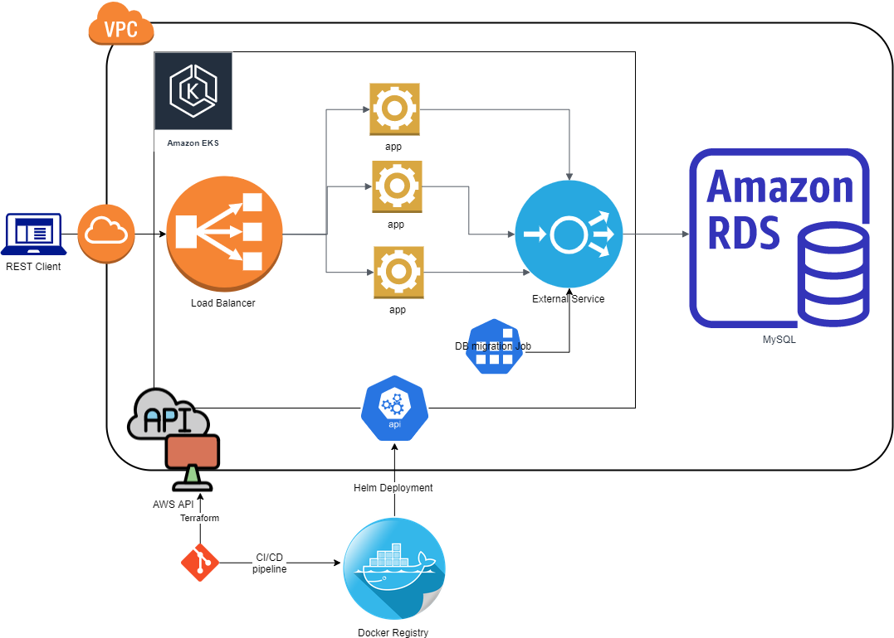

# Revolut Challenge

## Components:

- Spring boot Application (maven app with tests)
- ./testdata.sh - curl commands examples for manual testing
- ./Dockerfile - application build image 
- ./deployment/terraform - scripts for creating AWS infrastructure
- ./deployment/app - Helm chart fro k8s deployment

## Prerequisites

- JDK 1.8
- Maven
- Docker engine
- terraform
- kubectl
- helm 3 
- aws cli (aws-iam-authenticator)

## Architecture 

## Build and deploy pipeline

    mvn -B install
    docker build . --file Dockerfile --tag androidleha/revolut:latest
    docker push androidleha/revolut:latest
    cd ./deployment/terraform
    terraform apply -var 'access_key=aws_access_key' -var 'secret_key=aws_secret_key'
    terraform output kubeconfig > ~/.kube/config
    terraform output values ../local.yaml
    cd ../
    helm install revolut ./app -f local.yaml
    helm test revolut

Notice: GitHub Action pipeline is covering only build app and deploy docker image to registry

## Possible enhancements

- Generate database credentials and put in k8s secrets
- Network security enhancements: close DB from external access, configure firewalls and etc.
- Scaling of EKS
- More helm tests (after deployment) and rollbacks
- API tests before deployment (integration tests)
- Complete CI/CD pipeline
- Monitoring of spring boot health actuator
